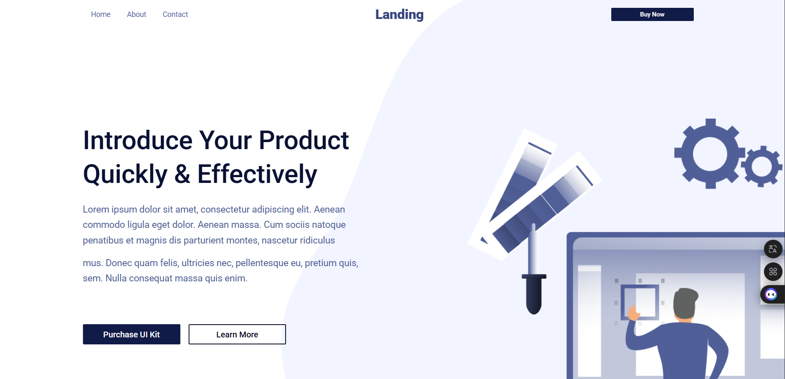

# Responsive Landing Page

A simple and responsive landing page built using **HTML** and **CSS**. This project demonstrates a basic layout suitable for showcasing a product, service, or portfolio.

## 🚀 Features

- Responsive design (mobile, tablet, desktop)
- Clean and modern layout
- Pure HTML and CSS (no frameworks)
- Easy to customize

## 📸 Preview

## 📁 Folder Structure

responsive-landing-page/
├── index.html
├── style.css
├── main.js
├── images
└── README.md

## 🛠️ Tech Stack

- HTML5
- CSS3 (media queries for responsiveness)

## 📲 Live Demo

Check out the live version here:  
👉 👉 [View Live Website](https://pixel-landing-lywegnc09-hassams-projects-013f0ea0.vercel.app/)
